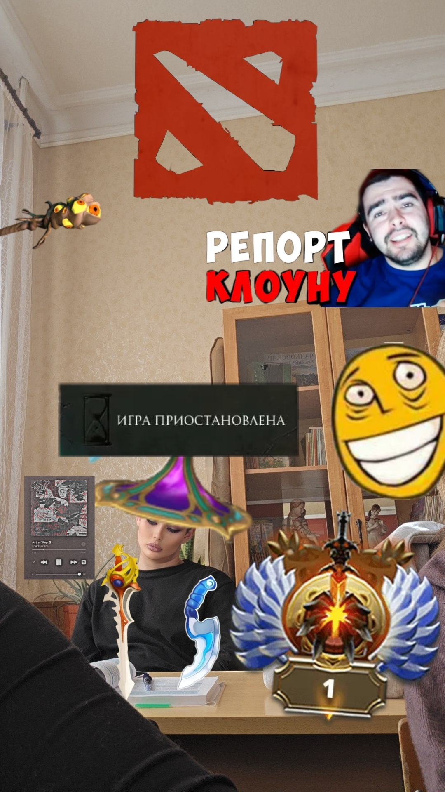

<!DOCTYPE html>
<html lang="ru">
  <head>
    <meta charset="UTF-8">
    <title>ZXC ILYA — JUGGERNAUT DESTROYER</title>
    
  </head>
  <body>
    

      

        ZXC MODE: ACTIVE
        
ILYA KOSTENKO

        
JUGGERNAUT UNSTOPPABLE

      

      

        

          <!-- Сюда можно вставить фото Ильи или арт Juggernaut -->
          
        

        

          

            Роль
            Керри (Carry)
          

          

            Мейн герой
            Juggernaut
          

          

            MMR (примерно)
            4500+
          

          

            Критических ударов
            999+
          

          Статус: Destroyer

          <a href="https://steamcommunity.com/profiles/76561199004267995" class="btn-boost">Заказать буст</a>
        

      

      

        Контакт: Telegram | VK | Discord
      

    

    <!-- Блок с медиа (гифки + видео) -->
    

      <!-- Медиа 1: Steam арт/кадр (Juggernaut) -->
      

        
      

      <!-- Медиа 2: Локальный GIF -->
      <!-- Работает только на твоём ПК. Для публикации положи GIF в папку сайта и используй src="загруженное.gif" -->
      

        
      

      <!-- Медиа 3: Видео (MP4) вместо GIF -->
      

        <video autoplay muted loop playsinline poster="https://i.imgur.com/yMjcvlQ.mp4">
          <source src="https://i.imgur.com/yMjcvlQ.mp4" type="video/mp4">
        </video>
      

    

  </body>
</html>
